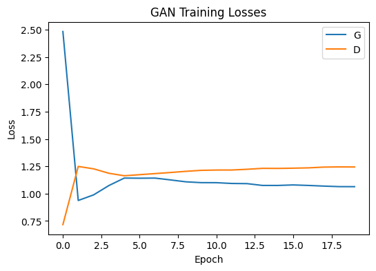
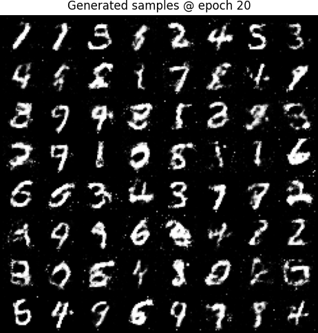

# Generative Adversarial Network (GAN) on MNIST  

This repository contains a simple PyTorch implementation of a **Generative Adversarial Network (GAN)** trained on the MNIST handwritten digits dataset.  
It is designed for learning and demonstration purposes, with clear step-by-step explanations.  

---

## Run in Google Colab  
You can run this notebook directly in Colab without any setup:  

  

---

## Features  
- Loads and preprocesses the MNIST dataset  
- Implements a **Generator** and **Discriminator** in PyTorch  
- Trains with the **adversarial loss (minimax game)**  
- Saves generated samples at different epochs  
- Creates a **GIF animation** of the generator’s progress during training  

---

## Requirements  
- Python 3.8+  
- PyTorch  
- Torchvision  
- Matplotlib  
- Jupyter or Google Colab  

If you run in Colab, everything is pre-installed   

---

## Example Results  

### GAN Training Losses 
  

### Generated Samples at Epoch 20  
  

### Training Progress GIF  
  

---

## References  
- [Goodfellow et al. (2014) Generative Adversarial Nets](https://arxiv.org/abs/1406.2661)  
- [PyTorch GAN Tutorial](https://pytorch.org/tutorials/beginner/dcgan_faces_tutorial.html)  

---

## Author  
Made by **Pouya Shamshiri**  
Feel free to fork, open issues, or suggest improvements!  
